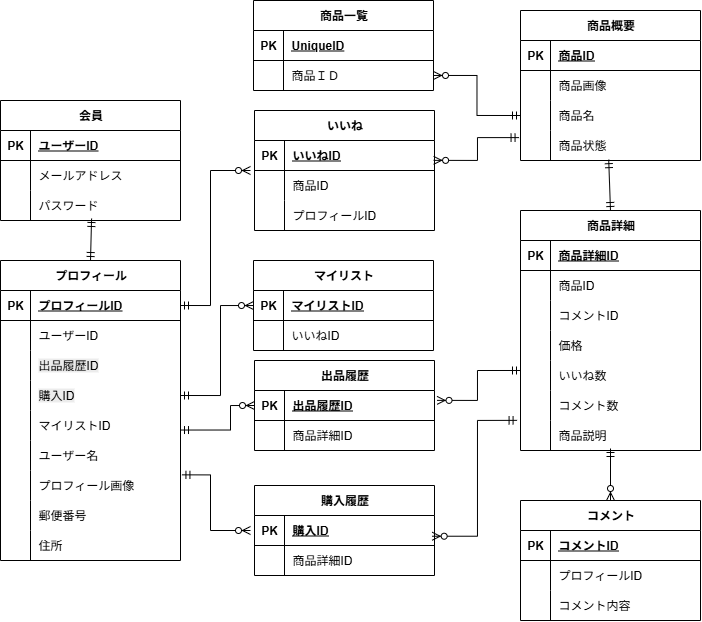

# 模擬案件_

## 構築環境
### Docker と Docker Compose のインストール
1. docker-compose.ymlを使い　docker-compose up -d --build　コマンドでビルド

### Laravelのセットアップ
1. docker-compose exec php bashでコンテナに入り .env.example をもとに.envファイルを作成
2. .envファイルの環境変数の変更
    * DB_HOSTをmysqlに変更
    * DB_USERNAMEをlaravel_userに変更
    * DB_PASSWORDをlaravel_passに変更
    * SESSION_DRIVERをdatabaseに変更

## 使用技術
1. laravel v8.83.29
2. PHP v8.1.33

## ER図

## URL
